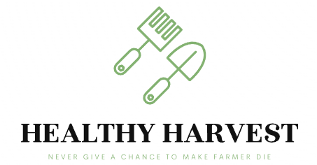

# Agriculture Healthy Harvest

This is an AI-based solution that helps farmers predict the right crop to grow, find the appropriate fertilizers, and detect crop diseases using uploaded images and data features such as soil, weather, and water content. Additionally, the solution provides a shopping cart feature to buy predicted seeds and tools from a website at a cheaper rate. Furthermore, the solution offers a statistical analysis of crop growth with respect to soil and weather conditions using a dashboard feature.

## Features

- Crop prediction based on uploaded images and data features
- Fertilizer recommendation based on crop and soil type
- Crop disease detection using uploaded images
- Shopping cart feature to buy predicted seeds and tools
- Statistical analysis of crop growth with respect to soil and weather conditions using a dashboard feature

Project Demo Video Link:
https://drive.google.com/file/d/1K98sI78wdXUq8WRtAv_xzS1TUWuZS7vb/view?usp=sharing

## Getting Started

### Prerequisites

- Python 3
- Flask
- OpenCV
- NumPy

### Installation

1. Clone the repository: `git clone https://github.com/gssrenathkumar/Agriculture_Healthy_Harvest.git`
2. Install the required packages: `pip install -r requirements.txt`
3. Run the application: `python app.py`

## Usage

1. Upload an image of the crop to predict the crop and find appropriate fertilizers
2. Upload an image of the diseased crop to detect the disease
3. Add predicted seeds and tools to the shopping cart
4. Find the crops which suits you the best
5. View statistical analysis of crop growth with respect to soil and weather conditions on the dashboard

## Project Shopping Cart Demo Link:

- https://farmers-shopping.vercel.app/

## Contributing

Contributions are always welcome! Please open an issue or pull request for any changes.

## License

This project is licensed under the MIT License - see the `LICENSE` file for details.
